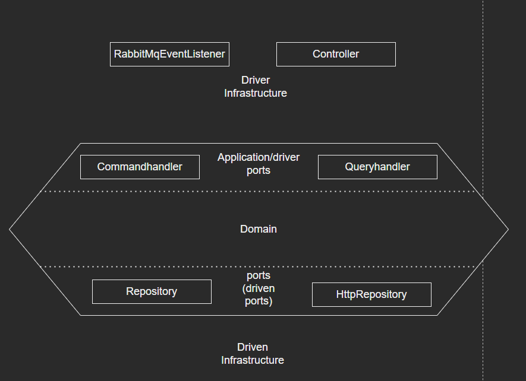
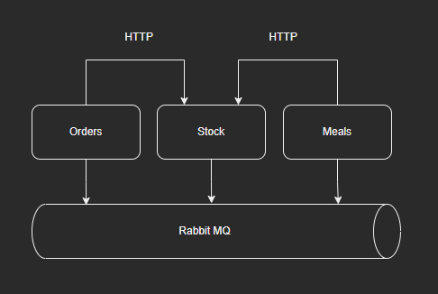

## Restaurant microservices documentation

###Inhoud
1. Algemeen
2. Architectuur
3. Orders microservice
4. Meals microservice
5. Stock microservice

###Algemeen
Dit project vormt samen met de microservices OrdersMicroservice, MealsMicroservice en StockMicroservice
een proof of concept voor een online restaurant bestelservice. 
De bestelservice bevat de volgende functionaliteiten:
- Toevoegen ingrediënt
- Toevoegen gerecht
- plaatsen van een bestelling
- bijhouden van de ingrediënten voorraad
- Bijhouden van gerechten op de menukaart op basis van de ingrediënten op voorraad

Het systeem bestaat uit de volgende microservices:

**Order microservice:** Deze microservice is verantwoordelijk voor de bestellingen. (https://github.com/keesjankoopsv1p/orders.git)    
**Meal microservice:** Deze microservice is verantwoordelijk voor het het opnemen van nieuwe gerechten en
het bijhouden van de menukaart op basis van de voorraad. (https://github.com/keesjankoopsv1p/meals.git)  
**Stock microservice** deze microservice is verantwoordelijk voor het bijhouden van de voorraad. (https://github.com/keesjankoopsv1p/stock.git)

###Architectuur:
Elke microservice maakt gebruik van een Hexagonal architecture.  
Deze ziet er als volgt uit:  
    
  
###Coordinatie
De onderlinge communicatie ziet er als volgt uit:  
  
Orders stuurt een http request naar stock wanneer er een nieuwe bestelling word geplaatst. De order service kijkt bij de stockservice of er genoeg ingredienten zijn voor de bestelling  
Meals stuurt een http request naar Stock wanneer er een nieuwe maaltijd wordt toegevoegd, Als de ingredienten waaruit het nieuwe gerecht bestaat op voorraad zijn, dan komt het nieuwe gerecht gelijk op de menu kaart te staan.  

